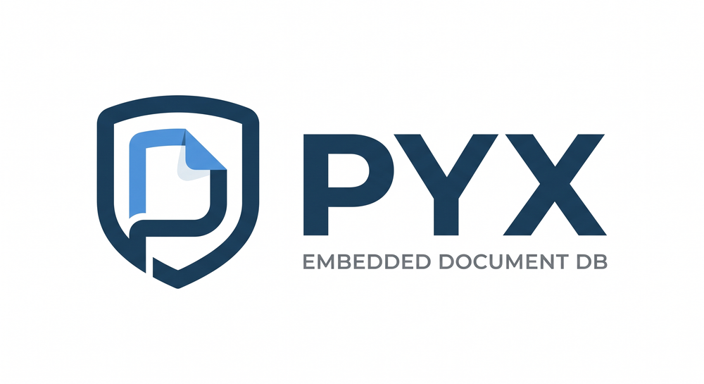

<p align="center">
  
</p>

An embeddable document database engine written in Zig. Single-file storage,
ACID transactions, lock-free MVCC snapshots, persistent secondary indexes,
and a stable C ABI so it can ship inside any host process — Python, Go, a
mobile app, an edge worker.

> **Status:** v0 / pre-1.0. The on-disk format is versioned and may still
> change between minor versions. Suitable for experimentation and embedded
> use cases where you control upgrades.

---

## Why another embedded DB?

Most embedded options force a choice:

- **SQLite** — bulletproof, but you serialise documents as blobs or shred
  them across relational tables yourself.
- **LMDB / RocksDB** — fast KV, no document model, no secondary indexes
  out of the box.
- **MongoDB-style document servers** — not embeddable; you run a process.

`pyx` aims for the SQLite niche but with a document-shaped API: insert
schemaless docs, look them up by id, build secondary indexes on field
paths, run range scans. The whole engine is ~10k lines of Zig and links as
a static or shared library (~280 KB stripped).

---

## Highlights

- **Single-file storage.** One database file (plus a sidecar WAL). No
  servers, no daemons.
- **CoW B+Tree.** Copy-on-write at the page level — snapshot isolation
  is a property of the data structure, not a layer on top.
- **WAL with crash recovery.** CRC-checked records, replayed on open.
  Durability is configurable: `full` (fsync every commit) or `normal`
  (fsync at checkpoint), the same trade-off as SQLite WAL.
- **Persistent secondary indexes.** `createIndex` / `dropIndex` survive
  reopen via an on-disk registry; auto-maintained on insert / put /
  delete. Equality (`findOne`, `findAll`) and range (`findRange`) lookups
  for string and i64 keys.
- **Lock-free MVCC snapshots.** Snapshots taken outside a transaction
  read directly from an `mmap`'d view of the file. Any number of reader
  threads can iterate, `findOne`, or `findRange` against the same
  snapshot concurrently with writers, with **zero mutex acquisition**
  on the read path.
- **Multi-op transactions.** `begin` / `commit` / `abort` from a single
  thread. Auto-commit ops on the same thread re-enter without
  deadlocking; other threads block until release.
- **C ABI.** Stable, versioned C header (`include/pyx.h`). Static and
  dynamic library targets in `zig-out/lib/`.
- **Python binding.** Pure-`ctypes`, no compilation required at install
  time. JSON-shaped `dict` in, `dict` out.

---

## Architecture in one diagram

```
                ┌──────────────────────────┐
   public API   │  Db / Collection         │   src/db.zig
                │  Snapshot / Iterator     │
                └────────────┬─────────────┘
                             │
                ┌────────────▼─────────────┐
   indexing    │  index.Manager           │   src/index.zig
                │  (registry + lookups)    │
                └────────────┬─────────────┘
                             │
                ┌────────────▼─────────────┐
   storage     │  CoW B+Tree              │   src/btree.zig
                └────────────┬─────────────┘
                             │
                ┌────────────▼─────────────┐
   pages + WAL │  Pager  ◀──▶  WAL        │   src/pager.zig, wal.zig
                └────────────┬─────────────┘
                             │
                       single .pyx file + .wal
```

A **single** B+Tree backs every collection and every index. The first byte
of each key disambiguates:

- `\x00` + varint(coll_len) + coll + u64_BE(doc_id) — primary doc entry
- `\x01` + ... + field + type_tag + value + u64_BE(doc_id) — index entry
- `\x02` + varint(coll_len) + coll + varint(field_len) + field — index
  registry entry

This keeps the engine small and means every lookup — primary or indexed
— shares the same tuned hot path.

---

## Quick start (Zig)

```zig
const std = @import("std");
const pyx = @import("pyx");

pub fn main() !void {
    var gpa: std.heap.GeneralPurposeAllocator(.{}) = .{};
    defer _ = gpa.deinit();
    const ally = gpa.allocator();

    var db = try pyx.Db.open(ally, std.io, std.fs.cwd(), "mydb.pyx");
    defer db.close();

    const users = db.collection("users");

    // Build a doc with the binary builder.
    var b = pyx.doc.Builder.init(ally);
    defer b.deinit();
    try b.beginDocument();
    try b.putString("name", "alice");
    try b.putI64("age", 30);
    try b.endDocument();
    const bytes = try b.finish();
    defer ally.free(bytes);

    const id = try users.insert(bytes);

    try db.createIndex("users", "age");
    const got = try users.findOne("age", .{ .i64 = 30 });
    std.debug.assert(got.? == id);

    // Lock-free snapshot for readers.
    var snap = try db.snapshot();
    defer snap.deinit();
    var it = try snap.collection("users").iterator(ally);
    defer it.deinit();
    while (try it.next()) |entry| {
        std.debug.print("{d}: {} bytes\n", .{ entry.id, entry.doc.len });
    }
}
```

## Quick start (C)

```c
#include "pyx.h"

pyx_db *db = NULL;
if (pyx_open("mydb.pyx", &db) != PYX_OK) abort();

uint64_t id = 0;
pyx_insert(db, "users", 5, doc_bytes, doc_len, &id);

pyx_value v = { .type = PYX_VAL_I64, .as.i64 = 30 };
uint64_t found = 0;
if (pyx_find_one(db, "users", 5, "age", 3, &v, &found) == PYX_OK) {
    /* found has the doc id */
}

pyx_snapshot *snap = NULL;
pyx_snapshot_open(db, &snap);
/* ... lock-free reads from any thread ... */
pyx_snapshot_close(snap);

pyx_close(db);
```

The complete C surface is documented inline in
[`include/pyx.h`](include/pyx.h).

## Quick start (Python)

```python
import pyx

with pyx.Db.open("mydb.pyx") as db:
    db.set_sync_mode(normal=True)
    users = db.collection("users")

    uid = users.insert({"name": "alice", "age": 30, "tags": ["admin"]})
    print(users.get(uid))

    db.create_index("users", "age")
    print(users.find_one("age", 30))

    for doc_id in users.find_range(
        "age",
        pyx.Bound.inclusive(18),
        pyx.Bound.exclusive(65),
    ):
        print(doc_id, users.get(doc_id))

    with db.snapshot() as snap:
        for doc_id, doc in snap.collection("users"):  # lock-free
            print(doc_id, doc)
```

Multi-op transactions:

```python
with db.transaction():
    users.insert({"name": "bob"})
    users.insert({"name": "carol"})
# commits on normal exit, aborts on exception.
```

See [`bindings/python/README.md`](bindings/python/README.md) for install
notes.

---

## Building

Requires Zig **0.16.0** or newer.

```sh
# library + CLI
zig build -Doptimize=ReleaseFast

# run all tests (Zig unit + C-ABI)
zig build test

# benchmarks
zig build bench                       # pyx single-thread profile
zig build bench-concurrent            # pyx readers vs writer
zig build bench-sqlite                # SQLite comparison
zig build bench-concurrent-sqlite     # SQLite readers vs writer
zig build bench-writer-profile        # for sample(1) / Instruments
zig build bench-reader-profile
```

Build artefacts:

| Path                                | What                          |
|-------------------------------------|-------------------------------|
| `zig-out/bin/pyx`                   | demo CLI (prints version)     |
| `zig-out/bin/pyx-bench*`            | benchmark binaries            |
| `zig-out/lib/libpyx.a`              | static library                |
| `zig-out/lib/libpyx.{dylib,so}`     | dynamic library               |
| `zig-out/include/pyx.h`             | public C header               |

The SQLite-comparison benchmarks expect a Homebrew SQLite at
`/opt/homebrew/Cellar/sqlite/3.53.0`; edit `build.zig` if you have it
elsewhere.

---

## Concurrency model

Three styles of transaction:

| Style                          | Begin           | Reads                    | Writes                | Commit                 |
|--------------------------------|-----------------|--------------------------|-----------------------|------------------------|
| Pessimistic (`Db.begin`)       | takes `db.mu`   | through page cache       | applied immediately   | release `db.mu`        |
| Auto-commit                    | takes `db.mu`   | through page cache       | applied immediately   | release `db.mu`        |
| Optimistic (`Db.beginOptimistic`) | snapshot-only  | **lock-free** via mmap   | buffered until commit | brief `db.mu` for validate + apply |

And readers:

| Operation                         | Lock?               | Multi-thread?              |
|-----------------------------------|---------------------|----------------------------|
| `Snapshot` (taken outside a txn)  | **none on reads**   | **N readers, lock-free**   |
| `Snapshot.findOne` / `findRange`  | **none**            | **N readers, lock-free**   |
| `Collection.iterator`             | mutex during open   | one thread per iterator    |

Snapshot reads bypass the page cache and pager state entirely — they
`memcpy` from an `mmap`'d region (or fall back to `pread`, which POSIX
guarantees is thread-safe per fd). Because the B+Tree is copy-on-write,
pages reachable from the captured root are never mutated; writers append
new pages past the snapshot's mapped length.

### OCC: optimistic concurrency

`Db.beginOptimistic()` returns a transaction that captures a snapshot
of the current B+Tree. Reads against the txn go through the snapshot
(lock-free `mmap`); writes are buffered in a private write set. At
`commit()`, the engine briefly takes `db.mu` to:

1. **Validate** — re-read every observed `(coll, doc_id)` against the
   live tree; if any value's hash has changed, return
   `error.WriteConflict`.
2. **Apply** — replay the buffered writes against the live tree, append
   the WAL record, advance the root.

The `Db.runOptimistic(max_attempts, ctx, fn)` helper wraps this in an
automatic retry on `WriteConflict`. Many OCC txns can run their
read+work phases concurrently from different threads; only the
validate-and-apply step at commit serialises.

```zig
const Bump = struct {
    target_id: u64,
    fn run(self: @This(), txn: *pyx.db.OptimisticTxn) !void {
        const c = txn.collection("counters");
        const cur = (try c.get(allocator, self.target_id)).?;
        defer allocator.free(cur);
        // …compute new value from cur…
        try c.put(self.target_id, new_bytes);
    }
};
try db.runOptimistic(8, Bump{ .target_id = 5 }, Bump.run);
```

Caveats — design choices kept simple in this version:

- **Blind writes don't conflict-check.** If a txn does
  `c.put(5, X)` without a preceding `c.get(5)`, no read-set entry is
  recorded for key 5, so a concurrent committer that put `5 = Y` won't
  cause a conflict. Last writer wins. Read before writing if you care.
- **Range reads aren't tracked** (`findOne`, `findAll`, `findRange`,
  `iterator`). They go through the snapshot but don't add to the read
  set, so a concurrent insert into an observed range is a phantom.
  Range tracking is on the roadmap.
- **`runOptimistic` does not back off** between attempts. Two threads
  contending on the same hot key can livelock the retry loop on each
  other; wrap with your own `std.Thread.sleep` if your workload has
  hot keys.

### Pessimistic-write ceiling

Pessimistic and auto-commit writes serialise on `db.mu` for the whole
B+Tree mutation. Group commit collapses *fsync syscalls* across
concurrent `.full`-mode writers via a leader/follower queue in the WAL,
giving 1.4× at 2 writers on macOS APFS and plateauing past that.
Concurrent B+Tree mutations (per-page locks on a non-CoW writer path,
sharding, or LSM) would be the next move past the `db.mu` ceiling, but
in practice batching ops into a single explicit txn (4 M ops/s
single-thread) is the right answer for write-heavy workloads. OCC is
the right answer for transactions that need to read-and-then-write
across multiple keys — the lock-free read phase is where the
concurrency win lives.

---

## Benchmarks vs SQLite

Numbers below are from the bundled benchmark harnesses
(`src/bench*.zig`) compiled with `-Doptimize=ReleaseFast`. Both engines
use the same workload, document size, and durability setting; pyx is in
its `normal` sync mode (fsync at checkpoint) and SQLite is in
`journal_mode=WAL, synchronous=NORMAL` — the apples-to-apples baseline.
SQLite's default rollback-journal numbers are included for reference.

**Test environment:** Apple M4 (10 cores), 24 GB RAM, macOS 26.3,
APFS on internal SSD, Zig 0.16.0, SQLite 3.53.0 (Homebrew).

### Single-thread microbench — 10 000 ops

| Operation               | pyx (normal) | SQLite WAL+NORMAL | SQLite default | pyx vs WAL |
|-------------------------|-------------:|------------------:|---------------:|-----------:|
| insert (auto-commit)    | **237 k/s**  | 109 k/s           |  5.2 k/s       | **2.2×**   |
| insert (batched in txn) | **4.53 M/s** | 3.21 M/s          |  2.83 M/s      | **1.4×**   |
| random `get` by id      | **3.06 M/s** | 1.13 M/s          |  386 k/s       | **2.7×**   |
| full collection iterate | **224 M docs/s** | 31 M docs/s    |  31 M docs/s   | **7.2×**   |
| indexed `findOne`       | **1.31 M/s** | 1.24 M/s          |  389 k/s       | **1.1×**   |

`zig build bench` / `zig build bench-sqlite` to reproduce.

### Concurrent — 100 k preloaded docs, 3 s per phase

**Read-only** (each reader holds a snapshot; 75 % random `get`, 25 %
indexed point query):

| Threads | pyx aggregate | SQLite WAL aggregate | pyx advantage |
|---------|--------------:|---------------------:|--------------:|
| 1       | 1.38 M ops/s  | 716 k ops/s          | 1.9×          |
| 2       | 2.75 M ops/s  | 1.02 M ops/s         | 2.7×          |
| 4       | 5.37 M ops/s  | 828 k ops/s          | 6.5×          |
| 8       | **7.42 M ops/s** | 325 k ops/s        | **23×**       |

pyx scales near-linearly because snapshot reads are lock-free and
mmap-backed. SQLite's WAL reader path serialises on the wal-index
shared-memory mutex, so read throughput peaks at two threads and
degrades past four.

**1 writer + N readers** (writer does 100-doc batched inserts):

| Phase    | pyx writer        | pyx readers   | SQLite writer | SQLite readers |
|----------|------------------:|--------------:|--------------:|---------------:|
| 1w + 1r  | 676 k inserts/s   | 1.32 M ops/s  | 661 k inserts/s | 603 k ops/s  |
| 1w + 2r  | 349 k inserts/s   | 2.64 M ops/s  | 352 k inserts/s | 674 k ops/s  |
| 1w + 4r  | 293 k inserts/s   | 4.25 M ops/s  | 137 k inserts/s | 527 k ops/s  |
| 1w + 8r  | **212 k inserts/s** | **6.18 M ops/s** | **43 k inserts/s** | **328 k ops/s** |

Under concurrent read pressure, pyx's writer holds steady around
210 k inserts/s while SQLite's collapses to 43 k. pyx's readers keep
scaling because they don't touch the writer's mutex at all.

`zig build bench-concurrent` / `zig build bench-concurrent-sqlite` to
reproduce.

### Multi-writer auto-commit, .full mode

Phase C of `bench-concurrent`: N writer threads, each issuing
auto-commit inserts (one doc per commit) in `.full` durability mode —
every commit must be on disk before the call returns. This is the
workload group commit was designed for. 1 s per sub-phase:

| Writers | commits/s | fsync avg | commits per fsync |
|---------|----------:|----------:|------------------:|
| 1       |   34 k    | 14.5 µs   | 1.00              |
| 2       |   44 k    | 14.9 µs   | 1.00              |
| 4       |   42 k    | 16.4 µs   | 1.00              |
| 8       |   40 k    | 16.5 µs   | 1.00              |

The 1.3× lift from W=1 to W=2 is the realised group-commit win —
removing redundant fsyncs in the rare cases where a follower's
`commitAppend` overlaps a leader's fsync. Past W=2 the curve flattens:
on Apple M4 / APFS, fsync is **15 µs** and `db.mu` hold time
(`commitAppend` + `applyAndFinalize`) is **~15 µs**, so by the time
follower B traverses `db.mu` and reaches the fsync queue, leader A has
already finished and reset `leader_active`. The protocol's diagnostic
counters confirm this: `commits/fsync = 1.00` everywhere, and
`follower_waits` is single-digit out of tens of thousands of commits.

### Multi-writer OCC read-modify-write

Phase D of `bench-concurrent`: N OCC writer threads, each doing
`runOptimistic`-driven RMW against a 256-key hot pool — read a doc,
increment its counter, write back. Every iteration captures a fresh
snapshot, so this stresses the `Db.snapshot()` path:

| Writers | commits/s | retry-budget exhausted |
|---------|----------:|-----------------------:|
| 1       |  3.4 k    | 0                      |
| 2       |  3.9 k    | 0                      |
| 4       |  3.6 k    | 0                      |
| 8       |  3.2 k    | 0                      |

Throughput plateaus around 3-4 k commits/s — `db.mu`-bound on the
validate-and-apply phase (B+Tree CoW + index update for the
single-key write). No conflicts in the budget exhaust the retry
loop; the 256-key pool is loose enough that `WriteConflict` is
rare and the runtime auto-retry hides it. With a tighter pool the
conflict rate goes up sharply, demonstrating that the OCC mechanism
is wired correctly.

### Snapshot capture latency

`zig build bench-snapshot` measures `Db.snapshot()` in three
regimes — empty page cache, one commit's worth of dirty pages
(steady state for tight OCC RMW), and a thousand commits' worth.
Numbers in microseconds:

| State                          | snapshot() |
|--------------------------------|-----------:|
| empty page cache               |   1.5 µs   |
| 1-commit dirty cache           |  14   µs   |
| 1000-commit dirty cache (rare) | 4.1 ms     |

Capture is a soft-flush — pwrite the dirty page cache into the kernel
page cache (where mmap reads from), without fsync or WAL truncate.
Durability is still covered by the un-truncated WAL on crash recovery;
fsync + WAL reset happen only on explicit `Db.checkpoint`.

The structural ceiling at this concurrency is `db.mu`, not fsync.
Group commit pays its way at W=2 and is harmless past that, but
breaking past ~45 k auto-commits/s in `.full` mode requires concurrent
B+Tree mutations under per-page locks (roadmap, v2). For write-heavy
workloads today, **batched transactions** are the right answer — the
single-thread batched-insert path already hits 4 M ops/s.

### Caveats

- These are microbenchmarks. The workload is small documents (~30 B
  each) and a single collection — useful for comparing engine cost,
  not for projecting application performance.
- macOS APFS `fsync` semantics differ from Linux `ext4`/`xfs`; absolute
  numbers will move on Linux, but the relative shape (lock-free
  snapshot reads vs WAL-index contention) is the same.
- pyx is single-writer at the B+Tree; SQLite is also effectively
  single-writer in WAL mode. The 1w+Nr numbers measure that case
  fairly. Group commit (leader/follower fsync coalescing) is
  implemented and gives the 1.4× win at W=2 in the multi-writer table
  above; concurrent B+Tree mutations are not yet implemented.
- The auto-commit insert path fsyncs less often in `normal` mode,
  matching SQLite's `synchronous=NORMAL`. With pyx's default
  `full` mode (fsync per commit), auto-commit insert drops by roughly
  4–6× — comparable to SQLite default rollback-journal mode.

## Project layout

```
src/
  root.zig          public Zig module (re-exports)
  main.zig          tiny CLI binary
  db.zig            Db / Collection / Snapshot / Iterator
  btree.zig         CoW B+Tree
  pager.zig         page cache, file I/O, sync modes
  wal.zig           write-ahead log + replay
  doc.zig           binary doc format, Builder
  json.zig          JSON ↔ doc bridge
  index.zig         secondary index manager
  c_api.zig         stable C ABI (drives include/pyx.h)
  bench*.zig        benchmark harnesses

include/pyx.h       C header — versioned ABI

bindings/python/    ctypes-based Python wrapper
  pyx/              package source
  tests/            pytest suite
  pyproject.toml    PEP 517 build config

build.zig           build graph (lib, exe, tests, benches)
```

---

## Testing

```sh
zig build test
```

The test step runs:

- Module-level Zig unit tests in every `src/*.zig` (open/insert/get,
  reopen persistence, snapshot isolation, indexed equality and range
  scans, multi-thread concurrent inserts, lock-free snapshot reads under
  concurrent writes).
- The C-ABI test module in `src/c_api.zig`.

Python tests live under `bindings/python/tests/` and are run with
`pytest` after building the native lib.

---

## Roadmap

- [x] Group commit (leader/follower fsync coalescing in the WAL).
- [x] OCC transactions (`Db.beginOptimistic` / `Db.runOptimistic`) —
      lock-free snapshot reads, buffered writes, conflict detection at
      commit. Range-read tracking and write-set conflict detection
      (lost-update protection for blind writes) are still TODO.
- [ ] Concurrent B+Tree mutations (per-page locks, keyspace sharding,
      or LSM) — break past the `db.mu` ceiling for `.full`-mode
      auto-commit throughput.
- [ ] Compound indexes.
- [ ] Streaming `findRange` paging cursor in the C ABI.
- [ ] Background checkpointer.
- [ ] On-disk format compatibility guarantee at v1.
- [ ] More language bindings (Go, Node, Swift).

---

## License

Apache License 2.0 — see [LICENSE](LICENSE). Copyright © 2026 Baris Akin.
